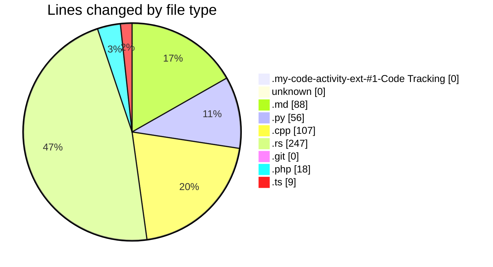
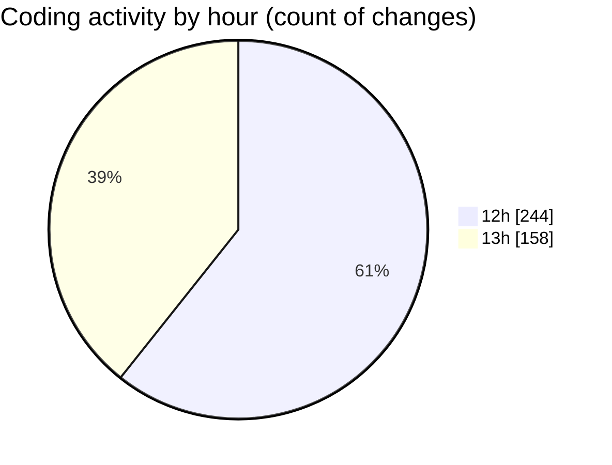

# leetcode-solutions - Activity Summary 

## Overall Statistics

| Stat                   | Value                                                             |
| ---------------------- | ----------------------------------------------------------------- |
| **Lines Added** (➕)   | 469                                          |
| **Lines Removed** (➖) | 56                                        |
| **Net Change** (↕)    | 413                |
| **Active Time** (⌚)   | 319 minutes |

## Modified Files
- **extension-output-undefined_publisher.my-code-activity-ext-#1-Code Tracking** (+0, -0)
- **** (+0, -0)
- **JOURNAL.md** (+39, -4)
- **494.py** (+23, -1)
- **15.cpp** (+75, -32)
- **88.rs** (+25, -1)
- **input** (+0, -0)
- **74.rs** (+39, -9)
- **74.rs.git** (+0, -0)
- **162.rs** (+16, -0)
- **162.rs.git** (+0, -0)
- **27.php** (+18, -0)
- **27.php.git** (+0, -0)
- **26.ts** (+9, -0)
- **26.ts.git** (+0, -0)
- **README.md** (+45, -0)
- **80.py** (+23, -9)
- **16.rs** (+31, -0)
- **17.rs** (+30, -0)
- **18.rs** (+52, -0)
- **19.rs** (+44, -0)

## Visualizations

### By File Type (Lines Changed)

### By Hour (Estimated Activity Count)

> **Last Updated:** 26/12/2024 13:17:09