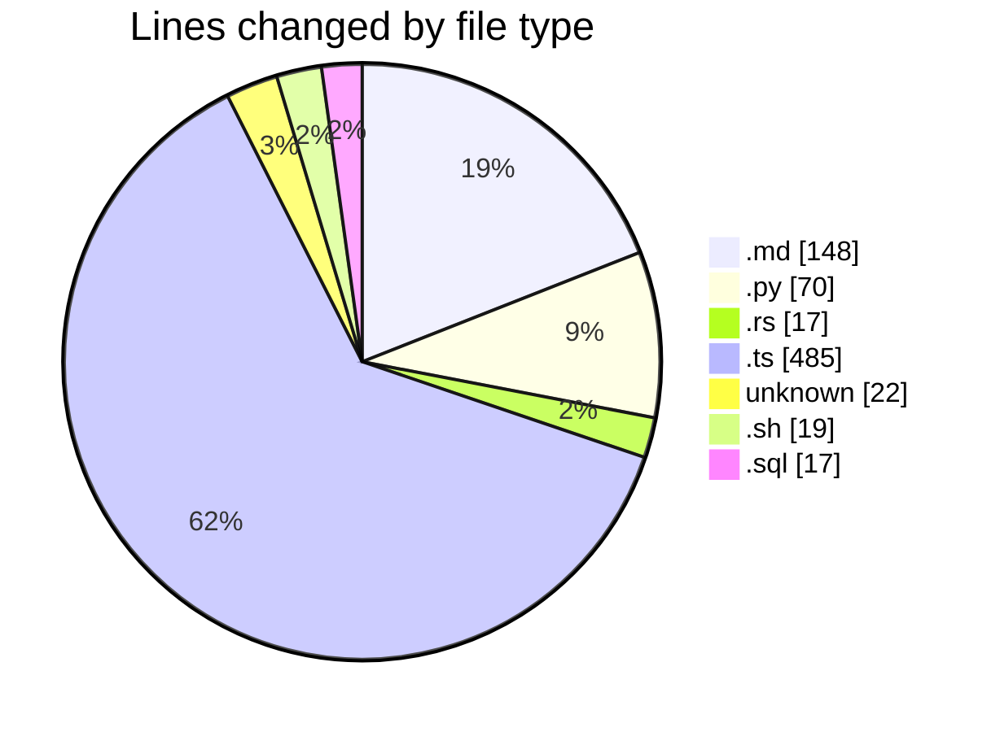
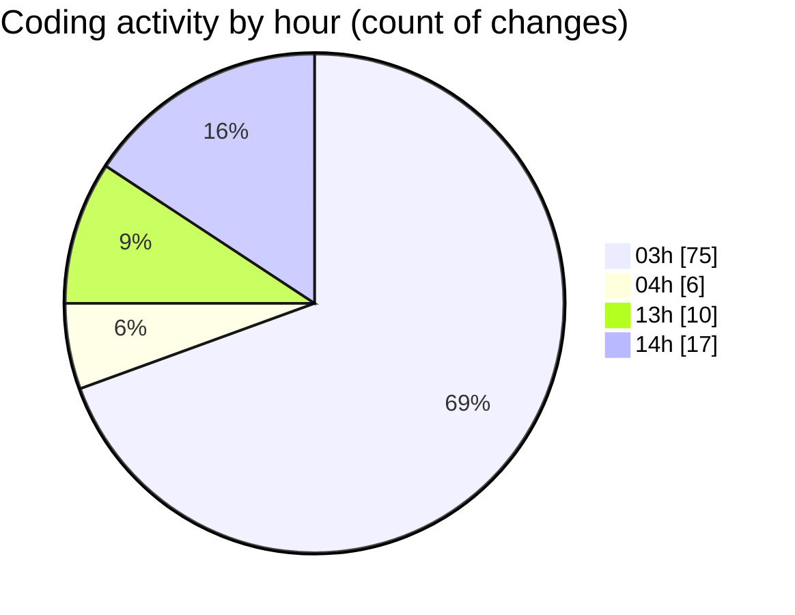

# leetcode-solutions - Activity Summary 

## Overall Statistics

| Stat                   | Value                                                             |
| ---------------------- | ----------------------------------------------------------------- |
| **Lines Added** (➕)   | 687                                          |
| **Lines Removed** (➖) | 91                                        |
| **Net Change** (↕)    | 596                |
| **Active Time** (⌚)   | 123 minutes |

## Modified Files
- **README.md** (+72, -0)
- **689.py** (+53, -17)
- **JOURNAL.md** (+75, -1)
- **1014.rs** (+17, -0)
- **24.ts** (+40, -9)
- **42.ts** (+26, -2)
- **44.ts** (+28, -3)
- **51.ts** (+41, -3)
- **52.ts** (+32, -0)
- **60.ts** (+33, -7)
- **65.ts** (+38, -6)
- **76.ts** (+52, -7)
- **COMMIT_EDITMSG** (+12, -10)
- **195.sh** (+10, -9)
- **2366.ts** (+20, -5)
- **2418.ts** (+10, -4)
- **2260.ts** (+13, -0)
- **22.ts** (+20, -0)
- **28.ts** (+17, -0)
- **29.ts** (+32, -4)
- **31.ts** (+29, -4)
- **1683.sql** (+4, -0)
- **1378.sql** (+6, -0)
- **1068.sql** (+7, -0)

## Visualizations

### By File Type (Lines Changed)

### By Hour (Estimated Activity Count)

> **Last Updated:** 28/12/2024 14:09:26