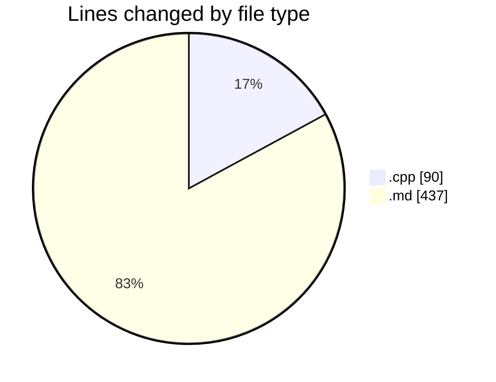
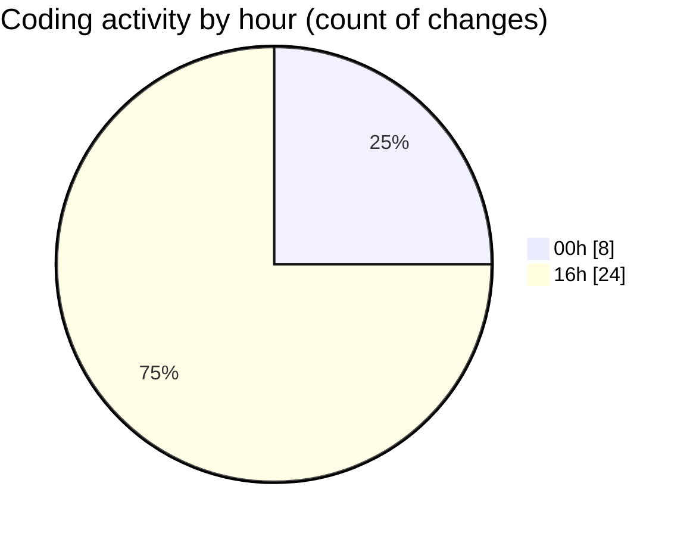

# leetcode-solutions - Activity Summary 

## Overall Statistics

| Stat                   | Value                                                             |
| ---------------------- | ----------------------------------------------------------------- |
| **Lines Added** (➕)   | 407                                          |
| **Lines Removed** (➖) | 120                                        |
| **Net Change** (↕)    | 287                |
| **Active Time** (⌚)   | 31 minutes |

## Modified Files
- **1639.cpp** (+42, -5)
- **JOURNAL.md** (+192, -69)
- **README.md** (+134, -42)
- **33.cpp** (+39, -4)

## Visualizations

### By File Type (Lines Changed)

### By Hour (Estimated Activity Count)

> **Last Updated:** 30/12/2024 00:39:53