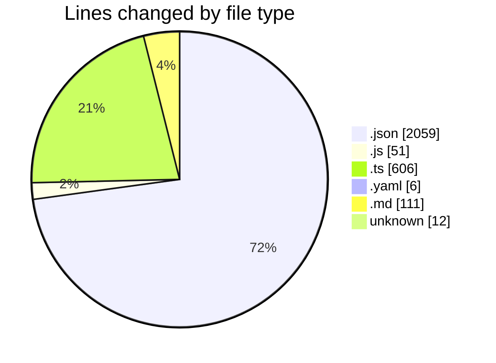
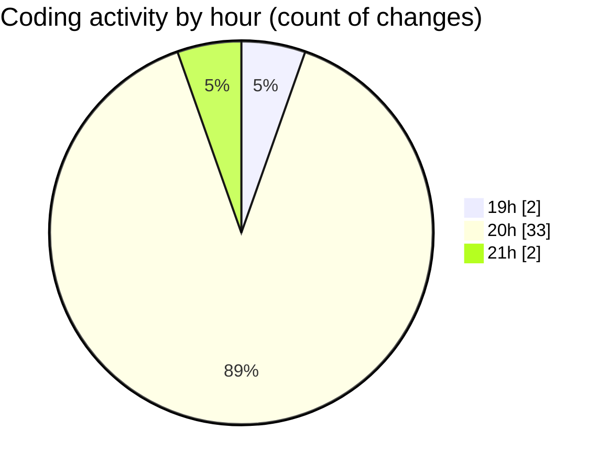

# my-code-activity-ext - Activity Summary 

## Overall Statistics

| Stat                   | Value                                                             |
| ---------------------- | ----------------------------------------------------------------- |
| **Lines Added** (➕)   | 2761                                          |
| **Lines Removed** (➖) | 84                                        |
| **Net Change** (↕)    | 2677                |
| **Active Time** (⌚)   | 38 minutes |

## Modified Files
- **package.json** (+66, -0)
- **package.json** (+73, -4)
- **package-lock.json** (+1903, -0)
- **.eslintrc.js** (+47, -4)
- **auth.ts** (+115, -17)
- **config.ts** (+49, -14)
- **status-bar.ts** (+115, -18)
- **repository.ts** (+251, -27)
- **trunk.yaml** (+6, -0)
- **tsconfig.json** (+13, -0)
- **easter egg.md** (+15, -0)
- **README.md** (+96, -0)
- **.vscodeignore** (+12, -0)

## Visualizations

### By File Type (Lines Changed)

### By Hour (Estimated Activity Count)

> **Last Updated:** 12/29/2024, 9:00:42 PM