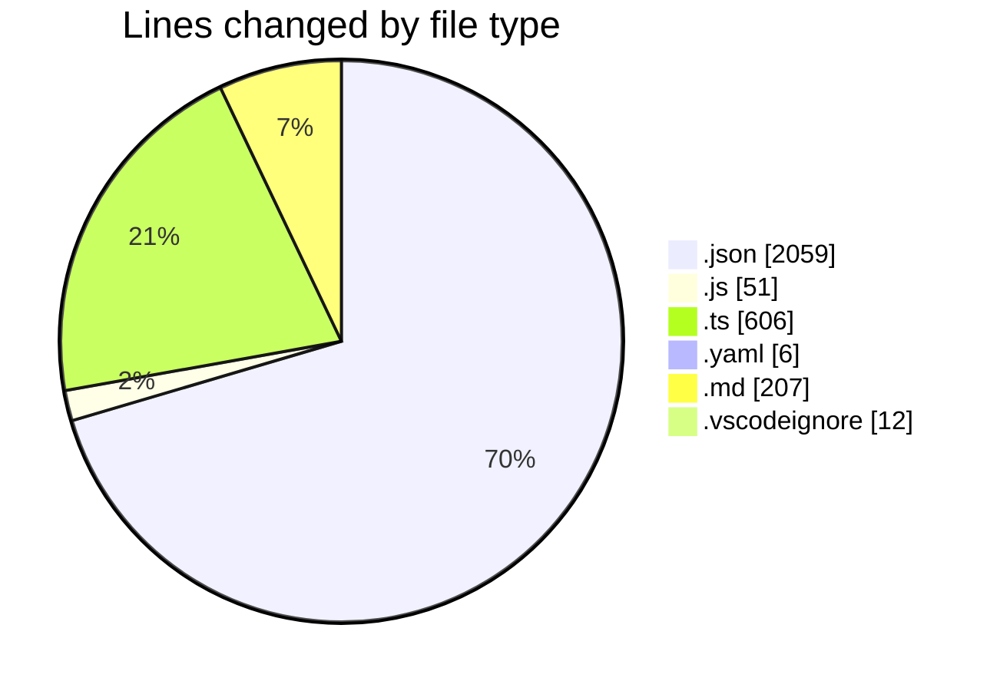
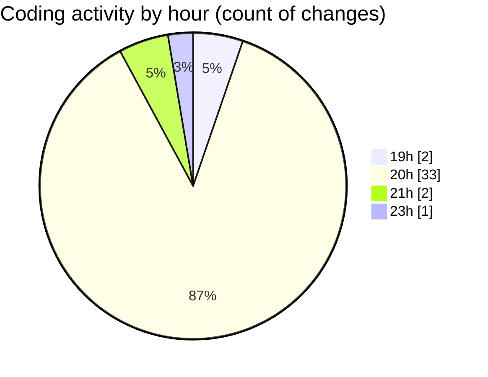

# my-code-activity-ext - Activity Summary 

## Overall Statistics

| Stat                   | Value                                                             |
| ---------------------- | ----------------------------------------------------------------- |
| **Lines Added** (➕)   | 2857                                          |
| **Lines Removed** (➖) | 84                                        |
| **Net Change** (↕)    | 2773                |
| **Active Time** (⌚)   | 38 minutes |

## Modified Files
- **package.json** (+66, -0)
- **c:\Users\tlind\project\my-code-activity-ext\package.json** (+73, -4)
- **c:\Users\tlind\project\my-code-activity-ext\package-lock.json** (+1903, -0)
- **c:\Users\tlind\project\my-code-activity-ext\.eslintrc.js** (+47, -4)
- **c:\Users\tlind\project\my-code-activity-ext\src\github\auth.ts** (+115, -17)
- **c:\Users\tlind\project\my-code-activity-ext\src\utils\config.ts** (+49, -14)
- **c:\Users\tlind\project\my-code-activity-ext\src\tracking\status-bar.ts** (+115, -18)
- **c:\Users\tlind\project\my-code-activity-ext\src\github\repository.ts** (+251, -27)
- **c:\Users\tlind\project\my-code-activity-ext\.trunk\trunk.yaml** (+6, -0)
- **c:\Users\tlind\project\my-code-activity-ext\tsconfig.json** (+13, -0)
- **c:\Users\tlind\project\my-code-activity-ext\easter egg.md** (+15, -0)
- **c:\Users\tlind\project\my-code-activity-ext\README.md** (+96, -0)
- **c:\Users\tlind\project\my-code-activity-ext\.vscodeignore** (+12, -0)
- **README.md** (+96, -0)

## Visualizations

### By File Type (Lines Changed)

### By Hour (Estimated Activity Count)

> **Last Updated:** 29/12/2024 23:59:59