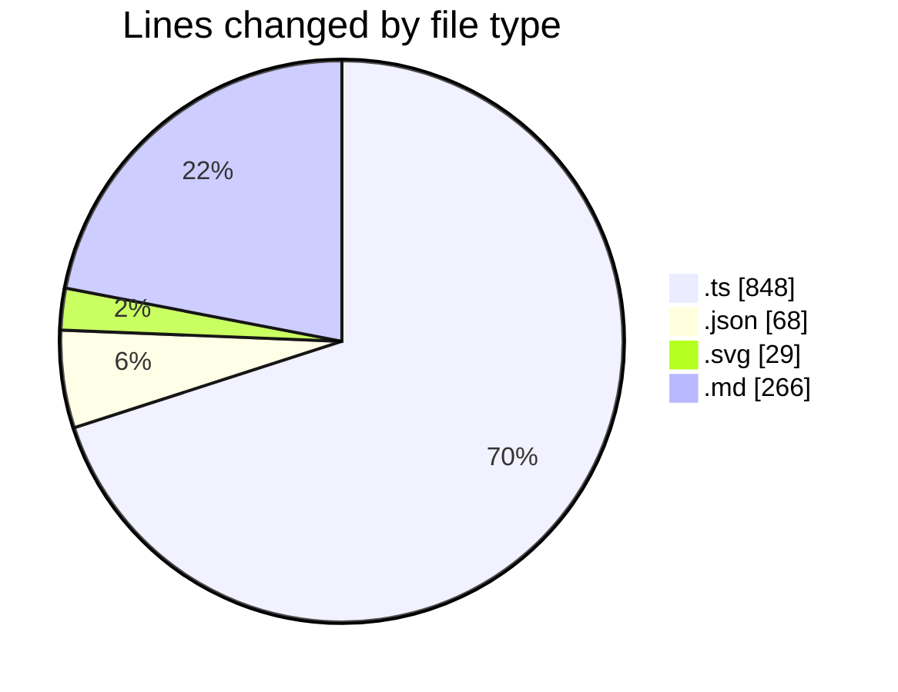
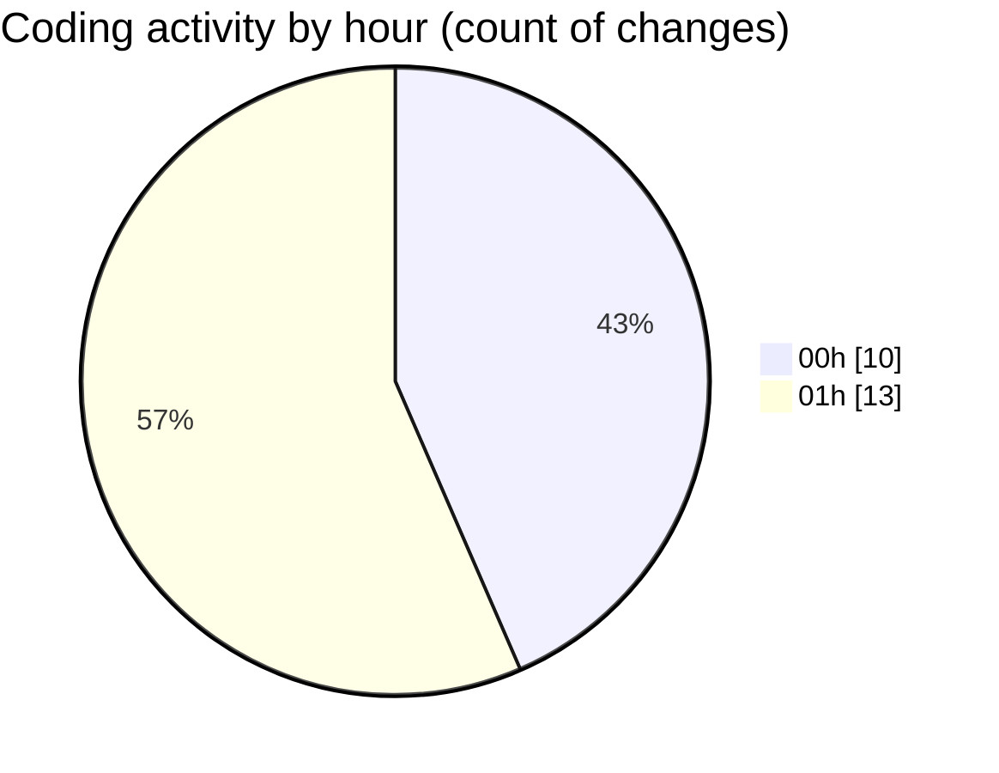

# my-code-activity-ext - Activity Summary 

## Overall Statistics

| Stat                   | Value                                                             |
| ---------------------- | ----------------------------------------------------------------- |
| **Lines Added** (➕)   | 1205                                          |
| **Lines Removed** (➖) | 6                                        |
| **Net Change** (↕)    | 1199                |
| **Active Time** (⌚)   | 26 minutes |

## Modified Files
- **activity.ts** (+508, -0)
- **status-bar.ts** (+113, -3)
- **repository.ts** (+224, -0)
- **package.json** (+68, -0)
- **icon.svg** (+26, -3)
- **CODE_OF_CONDUCT.md** (+57, -0)
- **CONTRIBUTING.md** (+78, -0)
- **SECURITY.md** (+52, -0)
- **bug_report.md** (+30, -0)
- **feature_request.md** (+19, -0)
- **pull_request_template.md** (+30, -0)

## Visualizations

### By File Type (Lines Changed)

### By Hour (Estimated Activity Count)

> **Last Updated:** 30/12/2024 01:30:52