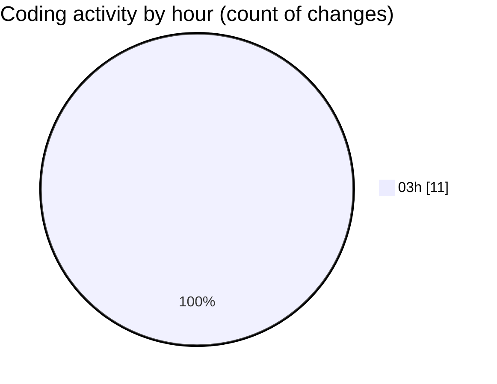

# my-code-activity-ext - Activity Summary 

## Overall Statistics

| Stat                   | Value                                                             |
| ---------------------- | ----------------------------------------------------------------- |
| **Lines Added** (➕)   | 350                                          |
| **Lines Removed** (➖) | 4                                        |
| **Net Change** (↕)    | 346                |
| **Active Time** (⌚)   | 12 minutes |

## Modified Files
- **bug_report.md** (+36, -0)
- **repository.ts** (+280, -0)
- **pull_request_template.md** (+34, -4)

## Visualizations

### By File Type (Lines Changed)

### By Hour (Estimated Activity Count)

> **Last Updated:** 12/30/2024, 3:56:39 AM