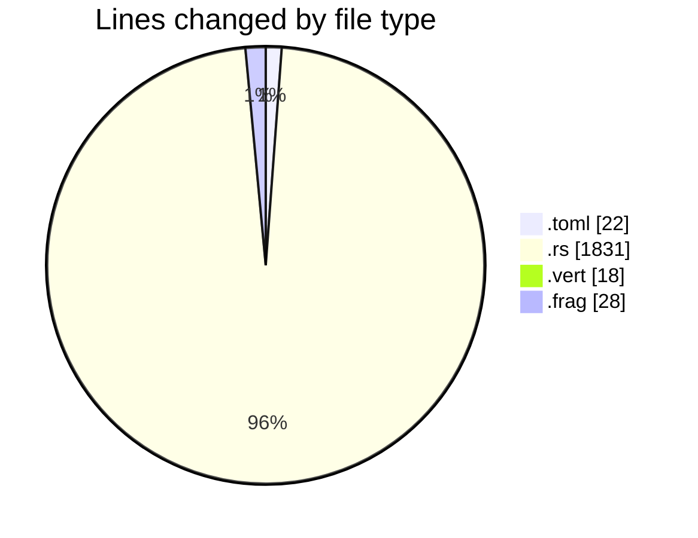
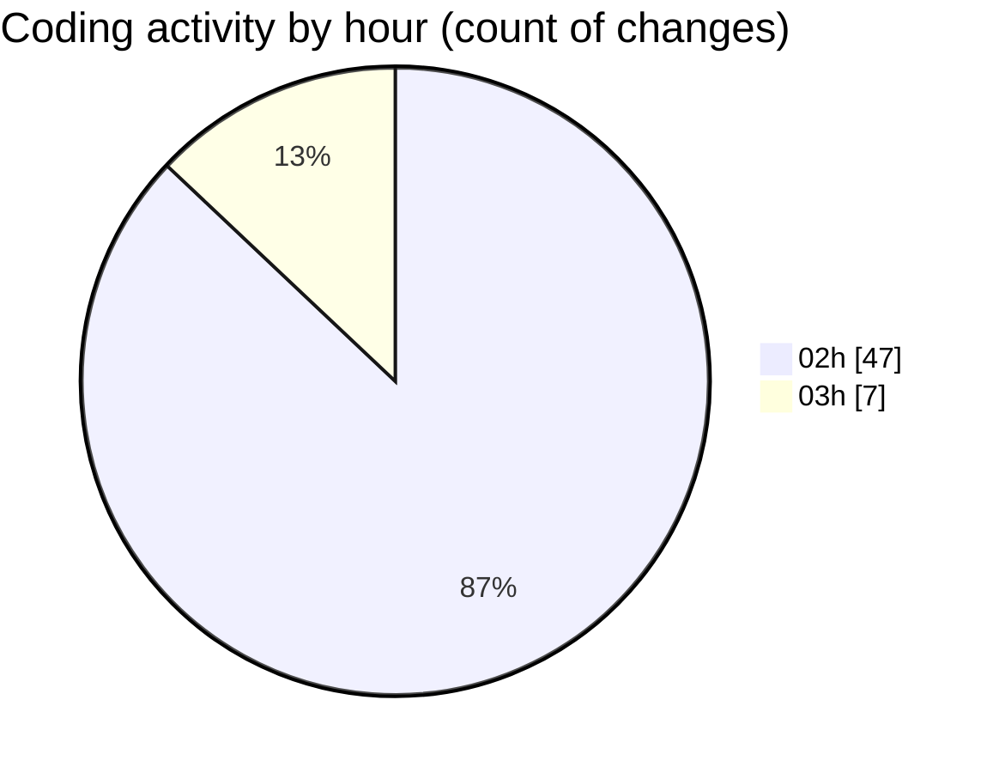

# 3dRust - Activity Summary 

## Overall Statistics

| Stat                   | Value                                                             |
| ---------------------- | ----------------------------------------------------------------- |
| **Lines Added** (➕)   | 1390                                          |
| **Lines Removed** (➖) | 509                                        |
| **Net Change** (↕)    | 881                |
| **Active Time** (⌚)   | 70 minutes |

## Modified Files
- **Cargo.toml** (+16, -6)
- **main.rs** (+835, -503)
- **gl_utils.rs** (+268, -0)
- **math.rs** (+225, -0)
- **shader.vert** (+18, -0)
- **shader.frag** (+28, -0)

## Visualizations

### By File Type (Lines Changed)

### By Hour (Estimated Activity Count)

> **Last Updated:** 02/01/2025 03:02:58