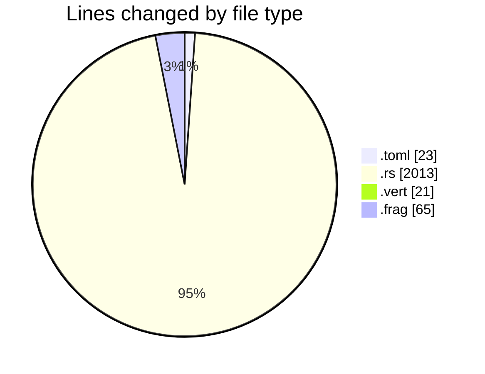
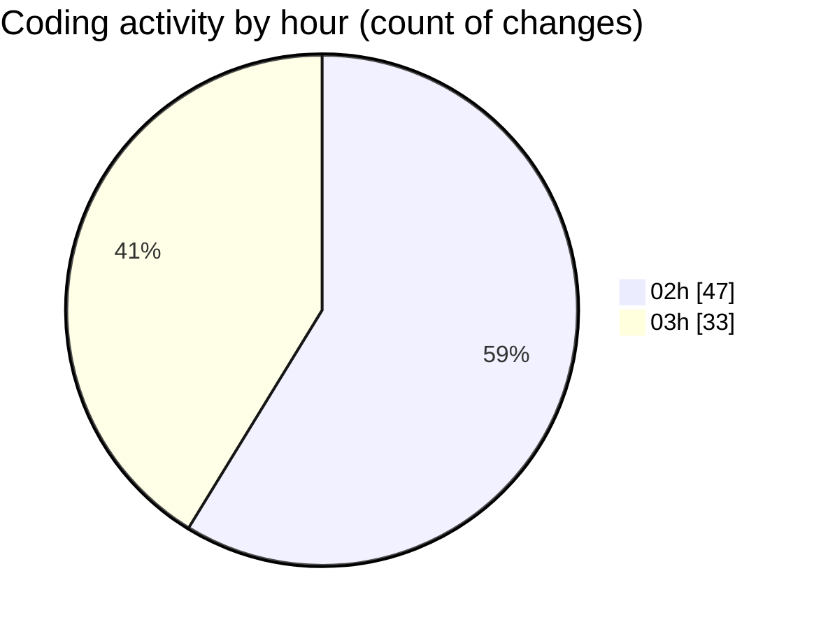

# 3dRust - Activity Summary 

## Overall Statistics

| Stat                   | Value                                                             |
| ---------------------- | ----------------------------------------------------------------- |
| **Lines Added** (➕)   | 1584                                          |
| **Lines Removed** (➖) | 538                                        |
| **Net Change** (↕)    | 1046                |
| **Active Time** (⌚)   | 108 minutes |

## Modified Files
- **Cargo.toml** (+17, -6)
- **main.rs** (+973, -515)
- **gl_utils.rs** (+300, -0)
- **math.rs** (+225, -0)
- **shader.vert** (+21, -0)
- **shader.frag** (+48, -17)

## Visualizations

### By File Type (Lines Changed)

### By Hour (Estimated Activity Count)

> **Last Updated:** 02/01/2025 03:27:58