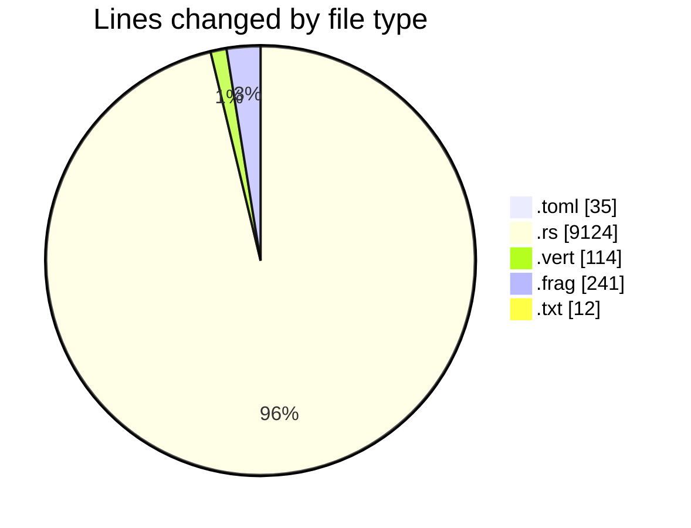
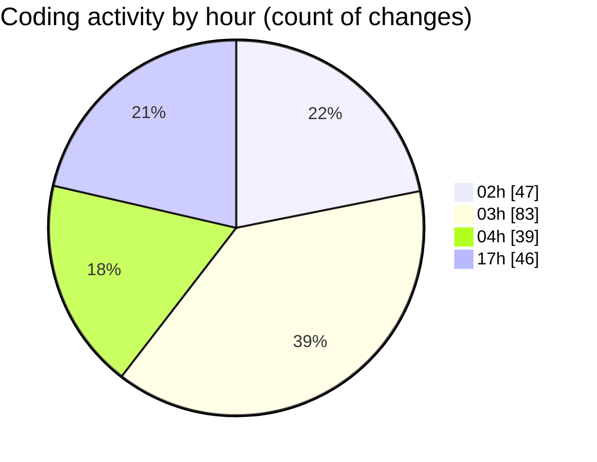

# 3dRust - Activity Summary 

## Overall Statistics

| Stat                   | Value                                                             |
| ---------------------- | ----------------------------------------------------------------- |
| **Lines Added** (➕)   | 7437                                          |
| **Lines Removed** (➖) | 2089                                        |
| **Net Change** (↕)    | 5348                |
| **Active Time** (⌚)   | 282 minutes |

## Modified Files
- **Cargo.toml** (+29, -6)
- **main.rs** (+5721, -1939)
- **gl_utils.rs** (+901, -33)
- **math.rs** (+491, -39)
- **shader.vert** (+21, -0)
- **shader.frag** (+48, -17)
- **block.vert** (+50, -29)
- **block.frag** (+128, -16)
- **out.txt** (+12, -0)
- **crosshair.vert** (+6, -0)
- **crosshair.frag** (+6, -0)
- **outline.vert** (+8, -0)
- **outline.frag** (+16, -10)

## Visualizations

### By File Type (Lines Changed)

### By Hour (Estimated Activity Count)

> **Last Updated:** 02/01/2025 17:57:30