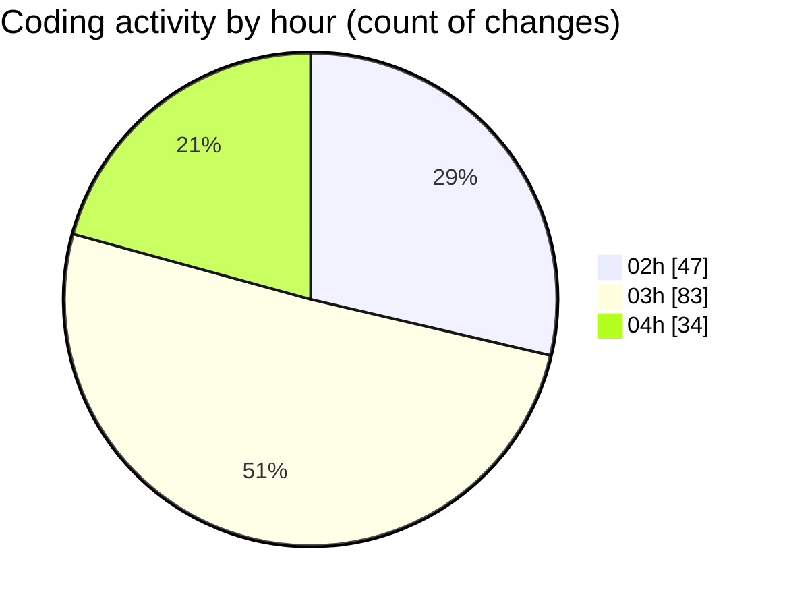

# 3dRust - Activity Summary 

## Overall Statistics

| Stat                   | Value                                                             |
| ---------------------- | ----------------------------------------------------------------- |
| **Lines Added** (➕)   | 4195                                          |
| **Lines Removed** (➖) | 1068                                        |
| **Net Change** (↕)    | 3127                |
| **Active Time** (⌚)   | 213 minutes |

## Modified Files
- **Cargo.toml** (+29, -6)
- **main.rs** (+2842, -929)
- **gl_utils.rs** (+616, -32)
- **math.rs** (+491, -39)
- **shader.vert** (+21, -0)
- **shader.frag** (+48, -17)
- **block.vert** (+50, -29)
- **block.frag** (+86, -16)
- **out.txt** (+12, -0)

## Visualizations

### By File Type (Lines Changed)

### By Hour (Estimated Activity Count)

> **Last Updated:** 02/01/2025 04:27:31