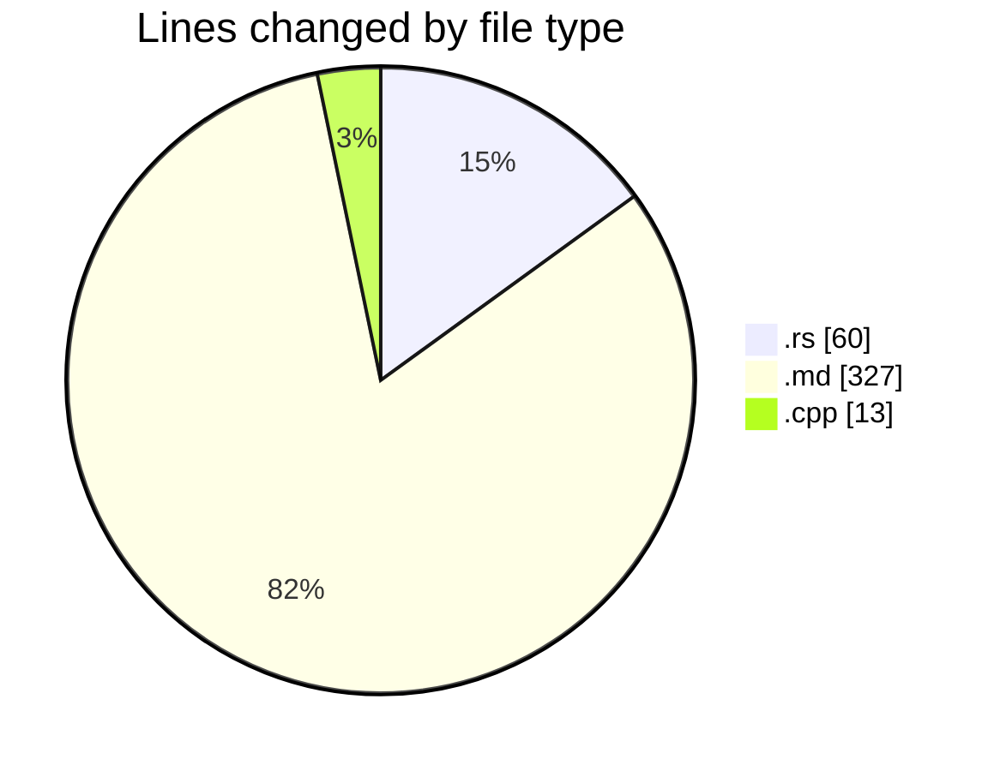
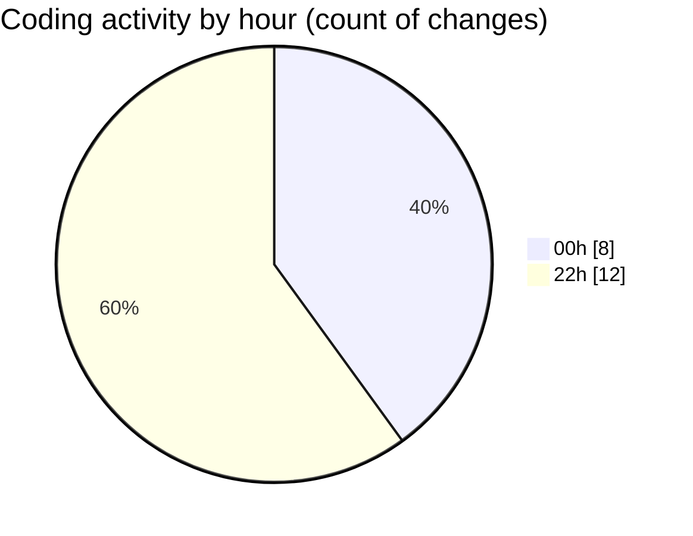

# leetcode-solutions - Activity Summary 

## Overall Statistics

| Stat                   | Value                                                             |
| ---------------------- | ----------------------------------------------------------------- |
| **Lines Added** (➕)   | 387                                          |
| **Lines Removed** (➖) | 13                                        |
| **Net Change** (↕)    | 374                |
| **Active Time** (⌚)   | 19 minutes |

## Modified Files
- **2559.rs** (+31, -4)
- **JOURNAL.md** (+139, -0)
- **README.md** (+188, -0)
- **2270.cpp** (+9, -4)
- **2270.rs** (+20, -5)

## Visualizations

### By File Type (Lines Changed)

### By Hour (Estimated Activity Count)

> **Last Updated:** 03/01/2025 22:16:02