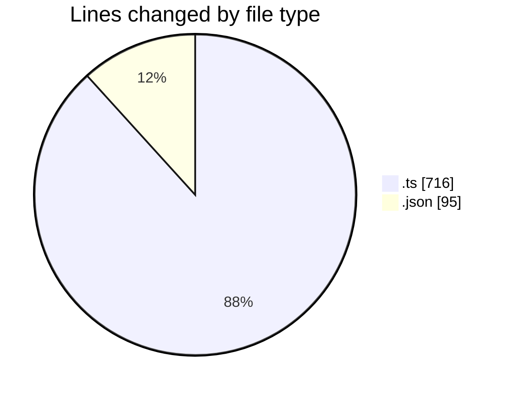
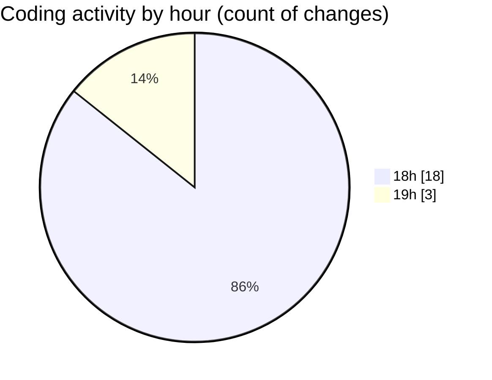

# my-code-activity-ext - Activity Summary 

## Overall Statistics

| Stat                   | Value                                                             |
| ---------------------- | ----------------------------------------------------------------- |
| **Lines Added** (➕)   | 762                                          |
| **Lines Removed** (➖) | 49                                        |
| **Net Change** (↕)    | 713                |
| **Active Time** (⌚)   | 19 minutes |

## Modified Files
- **extension.ts** (+204, -12)
- **status-bar.ts** (+110, -0)
- **config.ts** (+70, -10)
- **repository.ts** (+235, -18)
- **package.json** (+86, -9)
- **commit-message.ts** (+57, -0)

## Visualizations

### By File Type (Lines Changed)

### By Hour (Estimated Activity Count)

> **Last Updated:** 03/01/2025 19:03:55