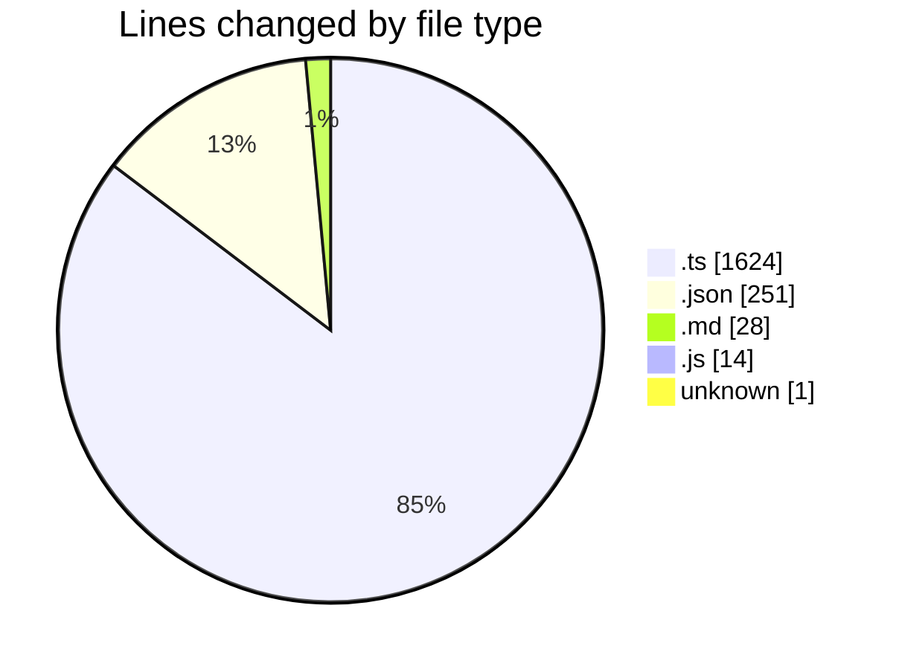
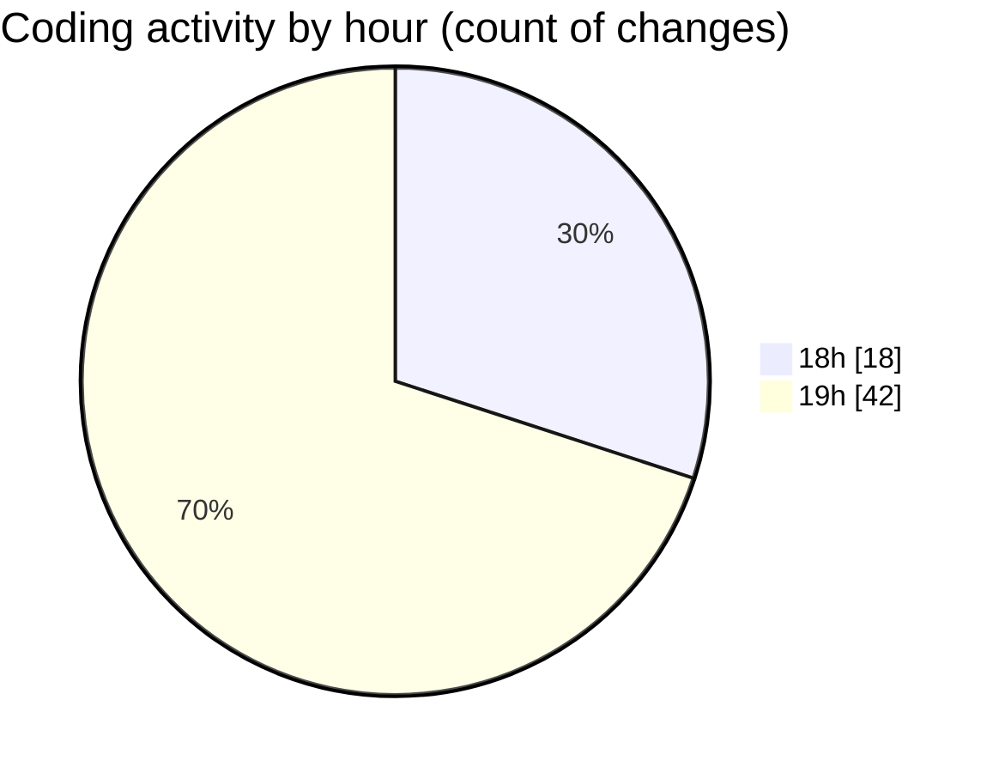

# my-code-activity-ext - Activity Summary 

## Overall Statistics

| Stat                   | Value                                                             |
| ---------------------- | ----------------------------------------------------------------- |
| **Lines Added** (➕)   | 1752                                          |
| **Lines Removed** (➖) | 166                                        |
| **Net Change** (↕)    | 1586                |
| **Active Time** (⌚)   | 62 minutes |

## Modified Files
- **extension.ts** (+204, -12)
- **status-bar.ts** (+110, -0)
- **config.ts** (+100, -40)
- **repository.ts** (+476, -18)
- **package.json** (+212, -39)
- **commit-message.ts** (+187, -56)
- **issue-8-response.md** (+28, -0)
- **ollama.ts** (+90, -0)
- **jest.config.js** (+14, -0)
- **repository.test.ts** (+290, -1)
- **vscode.ts** (+20, -0)
- **vscode.ts** (+20, -0)
- **.watchmanconfig** (+1, -0)

## Visualizations

### By File Type (Lines Changed)

### By Hour (Estimated Activity Count)

> **Last Updated:** 03/01/2025 19:45:38