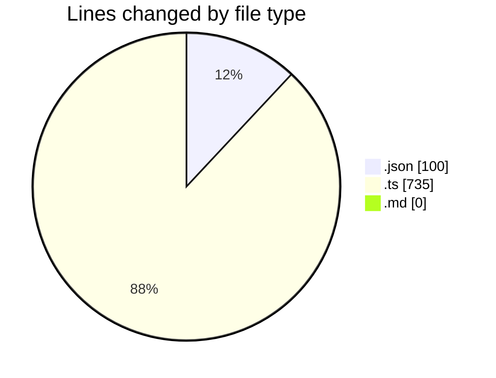
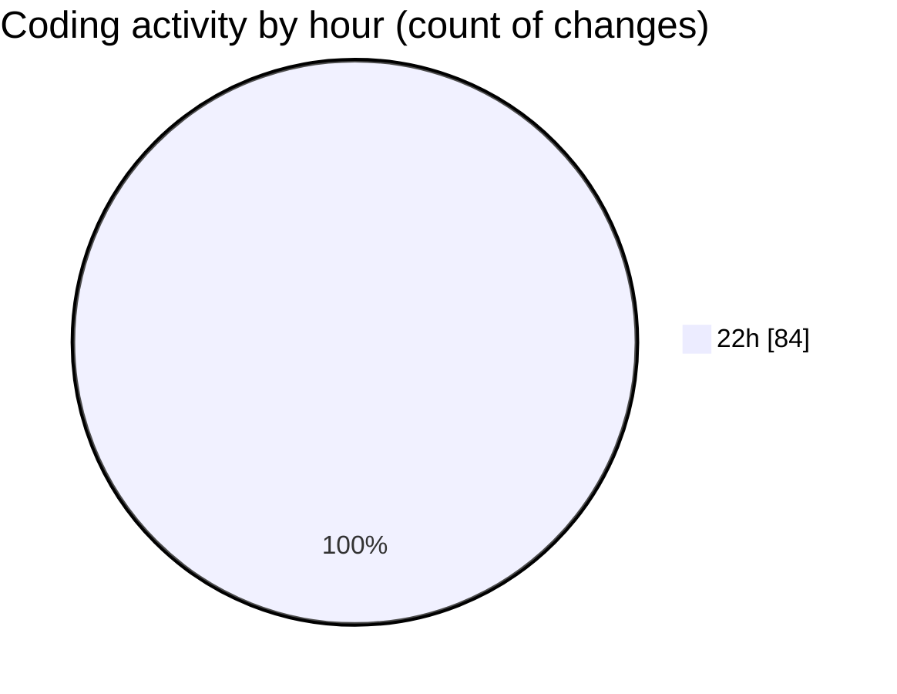

# my-code-activity-ext - Activity Summary 

## Overall Statistics

| Stat                   | Value                                                             |
| ---------------------- | ----------------------------------------------------------------- |
| **Lines Added** (➕)   | 835                                          |
| **Lines Removed** (➖) | 0                                        |
| **Net Change** (↕)    | 835                |
| **Active Time** (⌚)   | 73 minutes |

## Modified Files
- **package.json** (+100, -0)
- **activity.ts** (+735, -0)
- **README.md** (+0, -0)

## Visualizations

### By File Type (Lines Changed)

### By Hour (Estimated Activity Count)

> **Last Updated:** 03/01/2025 22:59:55