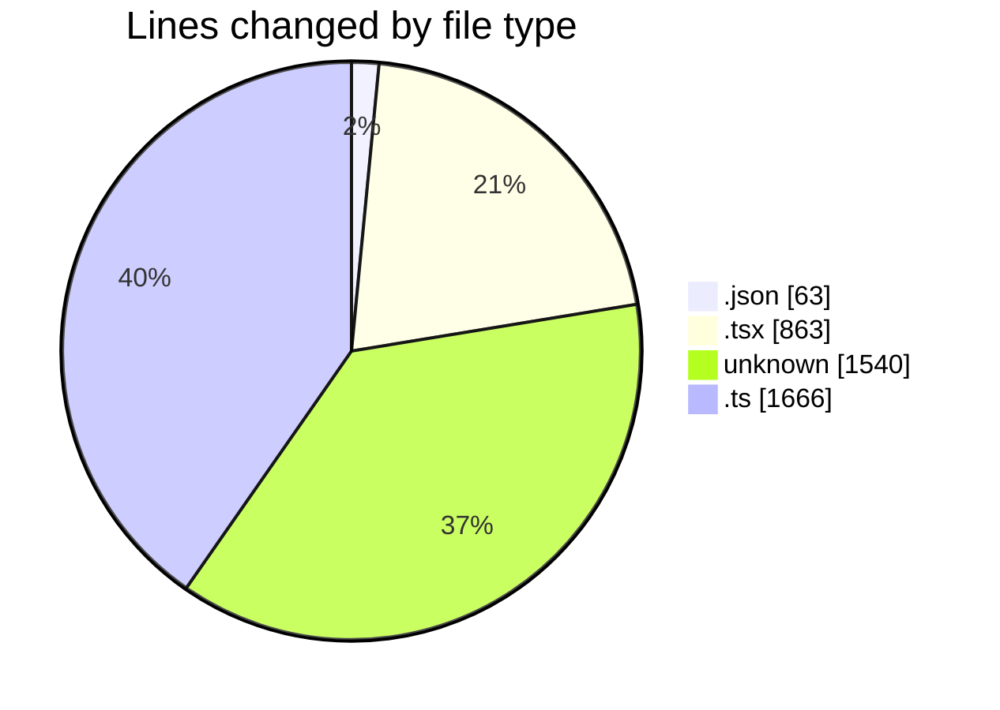
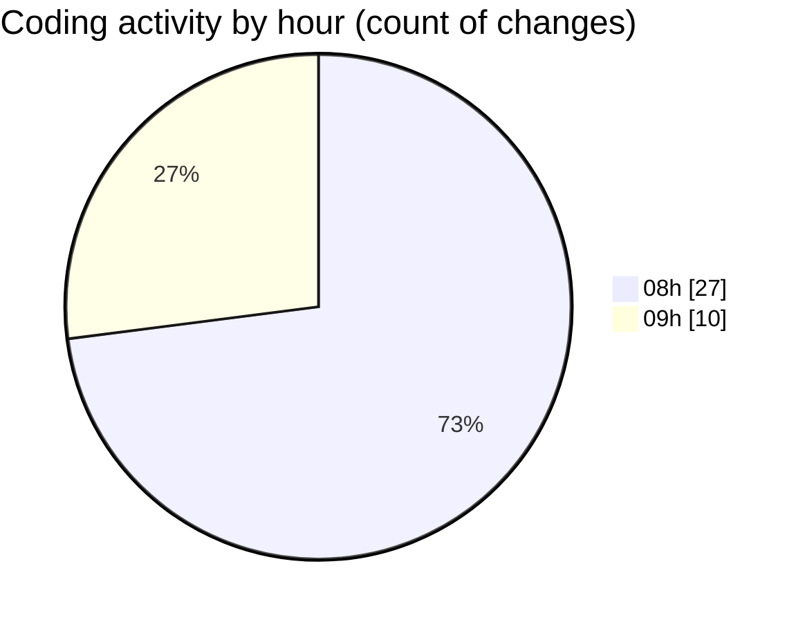

# nextjs-webllm - Activity Summary 

## Overall Statistics

| Stat                   | Value                                                             |
| ---------------------- | ----------------------------------------------------------------- |
| **Lines Added** (➕)   | 3987                                          |
| **Lines Removed** (➖) | 145                                        |
| **Net Change** (↕)    | 3842                |
| **Active Time** (⌚)   | 40 minutes |

## Modified Files
- **package.json** (+29, -0)
- **ChatClient.tsx** (+225, -2)
- **page.tsx** (+126, -87)
- **layout.tsx** (+85, -50)
- **client** (+27, -0)
- **build.ts** (+40, -0)
- **client.ts** (+27, -0)
- **api** (+76, -0)
- **constant** (+1437, -0)
- **api.ts** (+76, -0)
- **api.ts** (+76, -0)
- **ChatClient.tsx** (+223, -0)
- **constant.ts** (+1438, -1)
- **WebLLMDemo.tsx** (+65, -0)
- **webllm.worker.ts** (+8, -0)
- **package.json** (+1, -0)
- **tsconfig.json** (+28, -5)

## Visualizations

### By File Type (Lines Changed)

### By Hour (Estimated Activity Count)

> **Last Updated:** 03/01/2025 09:06:51