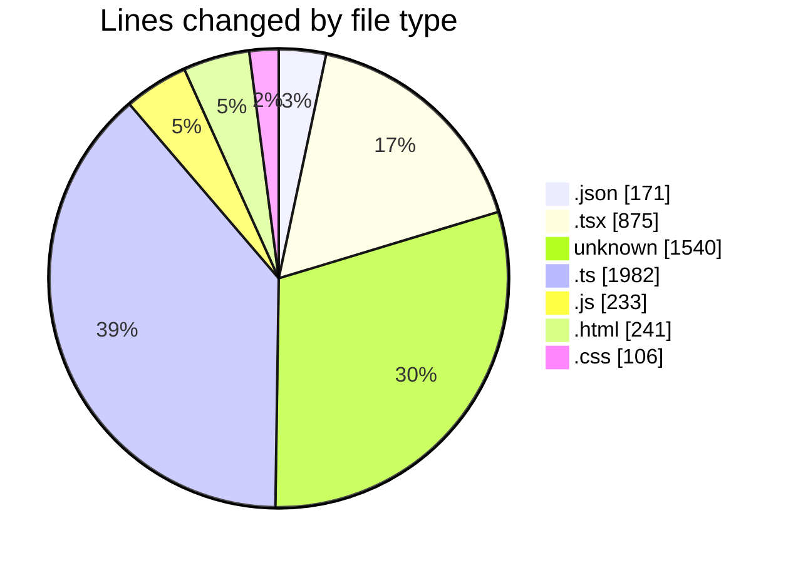
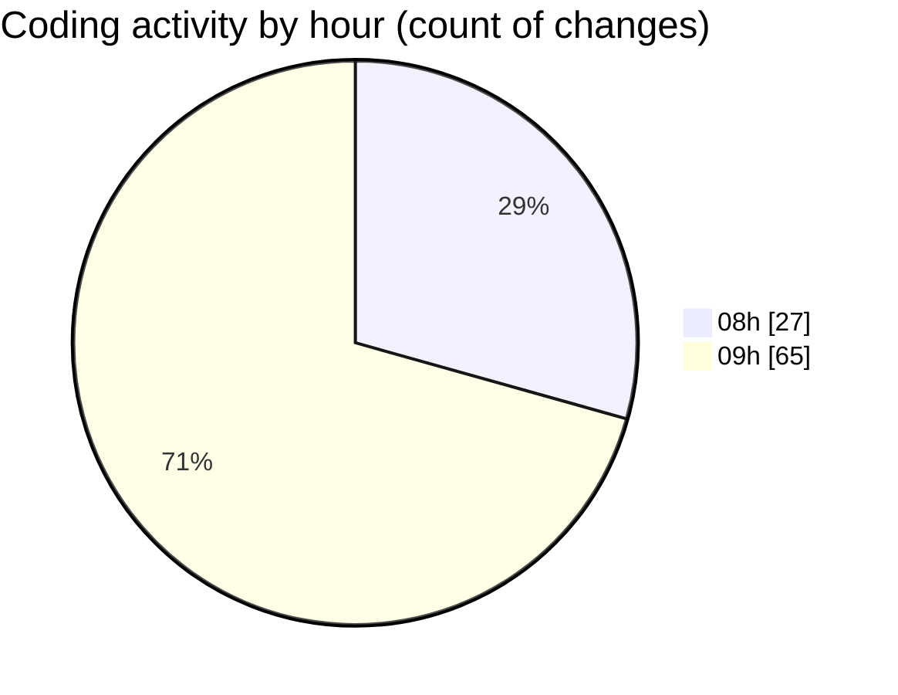

# nextjs-webllm - Activity Summary 

## Overall Statistics

| Stat                   | Value                                                             |
| ---------------------- | ----------------------------------------------------------------- |
| **Lines Added** (➕)   | 4940                                          |
| **Lines Removed** (➖) | 208                                        |
| **Net Change** (↕)    | 4732                |
| **Active Time** (⌚)   | 104 minutes |

## Modified Files
- **package.json** (+106, -30)
- **ChatClient.tsx** (+225, -2)
- **page.tsx** (+137, -88)
- **layout.tsx** (+85, -50)
- **client** (+27, -0)
- **build.ts** (+40, -0)
- **client.ts** (+27, -0)
- **api** (+76, -0)
- **constant** (+1437, -0)
- **api.ts** (+76, -0)
- **api.ts** (+76, -0)
- **ChatClient.tsx** (+223, -0)
- **constant.ts** (+1438, -1)
- **WebLLMDemo.tsx** (+65, -0)
- **webllm.worker.ts** (+8, -0)
- **package.json** (+2, -0)
- **tsconfig.json** (+28, -5)
- **test.js** (+21, -0)
- **index.js** (+181, -31)
- **index.html** (+30, -0)
- **index.css** (+106, -0)
- **text_completion.html** (+147, -0)
- **text_completion.ts** (+204, -0)
- **streaming.ts** (+111, -1)
- **streaming.html** (+64, -0)

## Visualizations

### By File Type (Lines Changed)

### By Hour (Estimated Activity Count)

> **Last Updated:** 03/01/2025 09:49:24