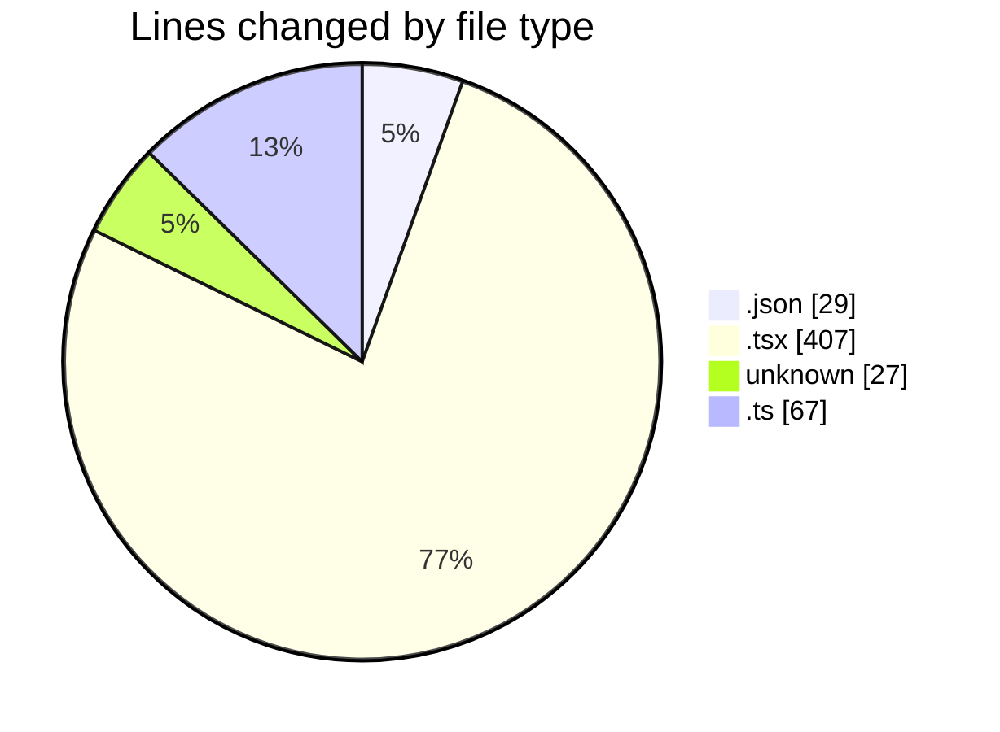
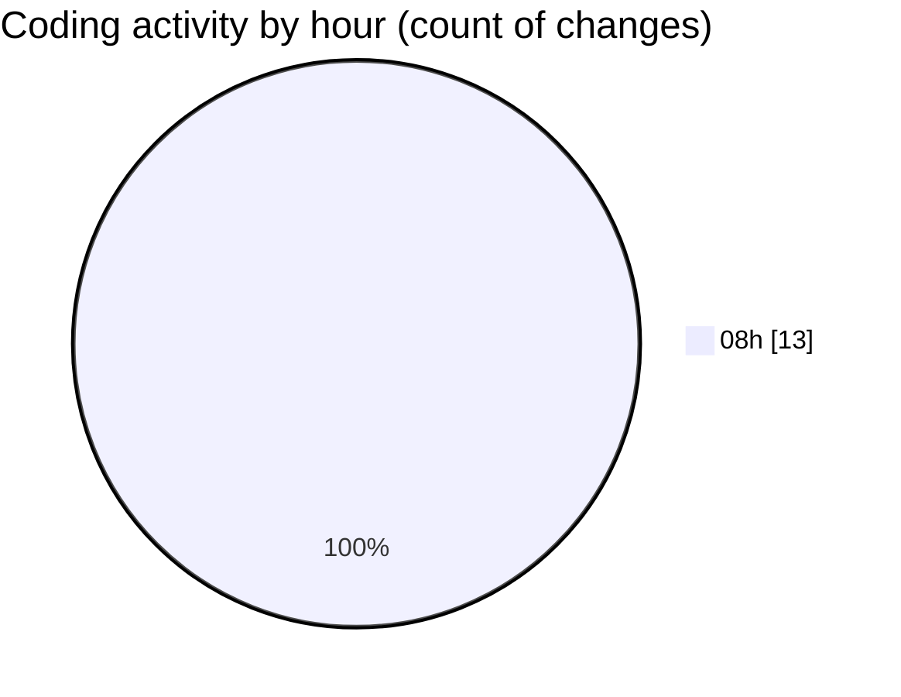

# nextjs-webllm - Activity Summary 

## Overall Statistics

| Stat                   | Value                                                             |
| ---------------------- | ----------------------------------------------------------------- |
| **Lines Added** (➕)   | 443                                          |
| **Lines Removed** (➖) | 87                                        |
| **Net Change** (↕)    | 356                |
| **Active Time** (⌚)   | 14 minutes |

## Modified Files
- **package.json** (+29, -0)
- **ChatClient.tsx** (+133, -0)
- **page.tsx** (+102, -87)
- **layout.tsx** (+85, -0)
- **client** (+27, -0)
- **build.ts** (+40, -0)
- **client.ts** (+27, -0)

## Visualizations

### By File Type (Lines Changed)

### By Hour (Estimated Activity Count)

> **Last Updated:** 03/01/2025 08:54:28