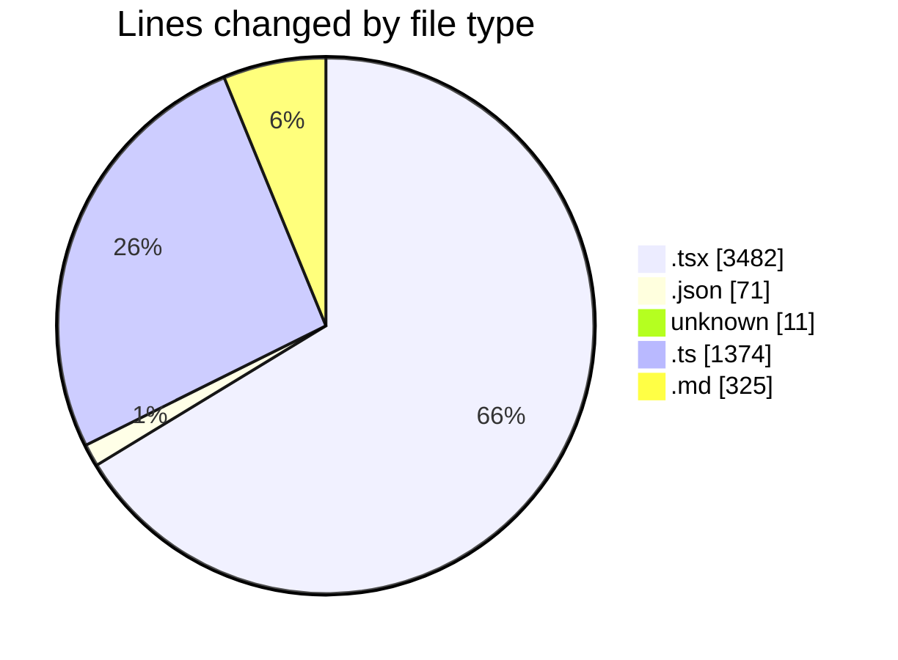
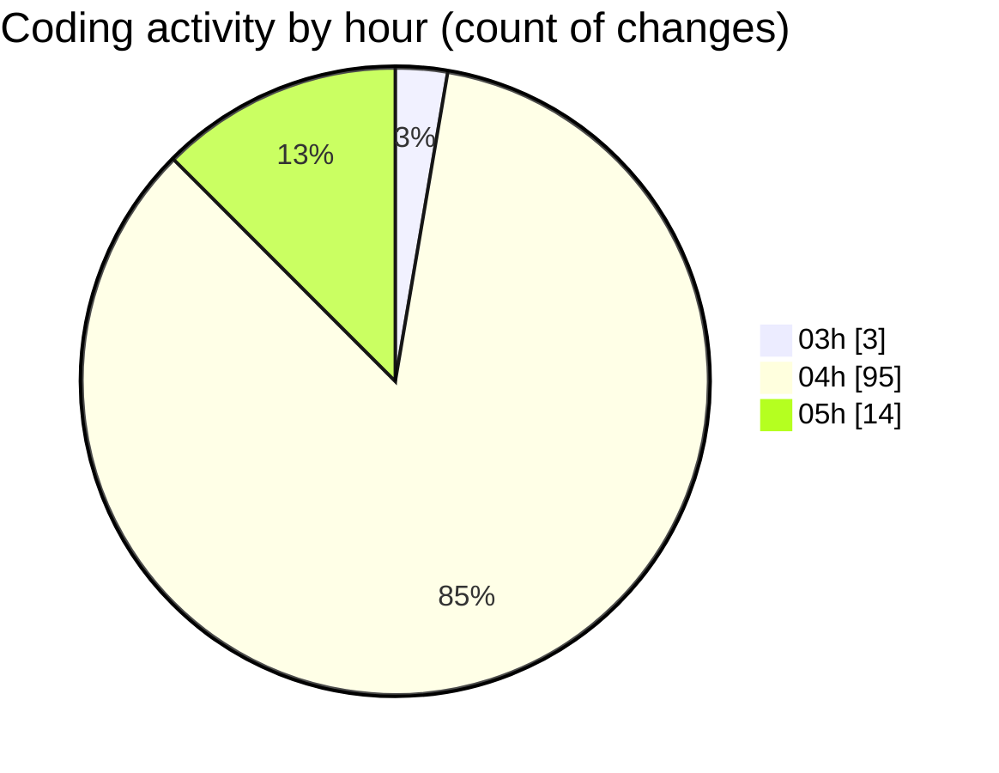

# tinycms - Activity Summary 

## Overall Statistics

| Stat                   | Value                                                             |
| ---------------------- | ----------------------------------------------------------------- |
| **Lines Added** (➕)   | 4839                                          |
| **Lines Removed** (➖) | 424                                        |
| **Net Change** (↕)    | 4415                |
| **Active Time** (⌚)   | 130 minutes |

## Modified Files
- **login.tsx** (+68, -1)
- **newsite.tsx** (+366, -0)
- **package.json** (+71, -0)
- **menu.tsx** (+231, -24)
- **IconSettings.tsx** (+79, -2)
- **COMMIT_EDITMSG** (+9, -2)
- **Sidebar.tsx** (+1036, -42)
- **pages.ts** (+27, -0)
- **EditImage.tsx** (+100, -3)
- **SectionList.tsx** (+521, -195)
- **blocks.ts** (+61, -0)
- **EditLabels.tsx** (+289, -0)
- **Labels.tsx** (+120, -7)
- **renderBlock.tsx** (+61, -0)
- **block.ts** (+77, -0)
- **markdownToHtml.ts** (+168, -0)
- **home.md** (+161, -145)
- **[slug].ts** (+107, -0)
- **markdown.ts** (+51, -0)
- **CreateSiteForm.tsx** (+277, -0)
- **index.ts** (+883, -0)
- **features.md** (+19, -0)
- **Title.tsx** (+57, -3)

## Visualizations

### By File Type (Lines Changed)

### By Hour (Estimated Activity Count)

> **Last Updated:** 03/01/2025 05:14:24