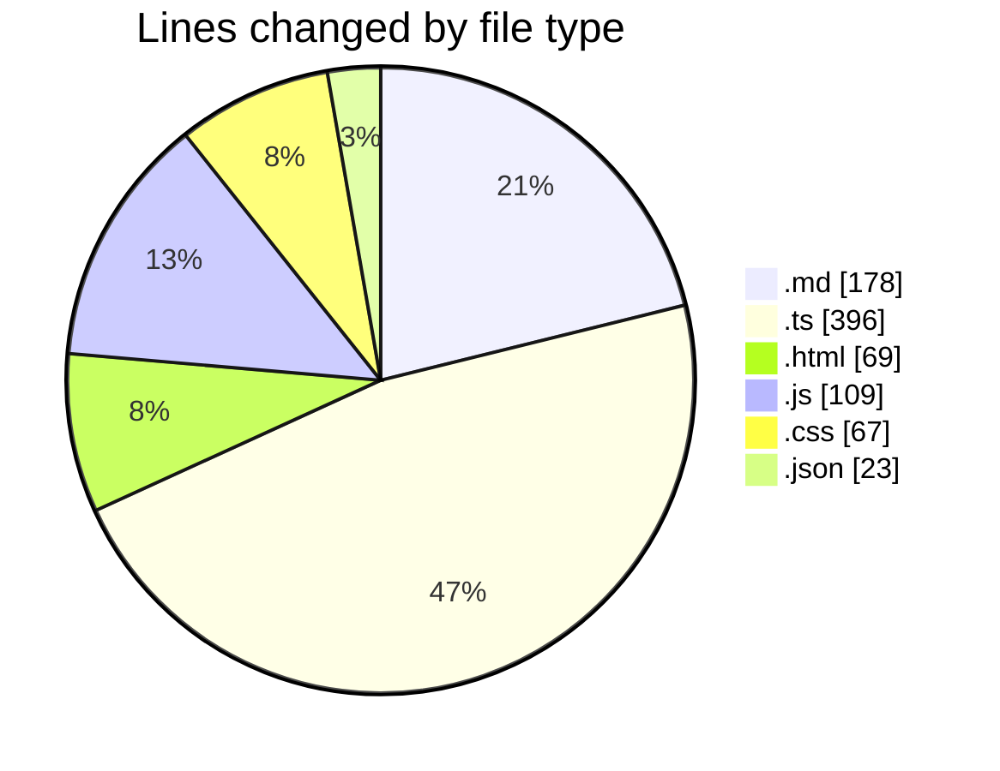

# my-code-activity-ext - Activity Summary 

## Overall Statistics

| Stat                   | Value                                                             |
| ---------------------- | ----------------------------------------------------------------- |
| **Lines Added** (➕)   | 702                                          |
| **Lines Removed** (➖) | 140                                        |
| **Net Change** (↕)    | 562                |
| **Active Time** (⌚)   | 32 minutes |

## Modified Files
- **feature_request_visual_analytics.md** (+51, -51)
- **feature_request_collaboration.md** (+19, -19)
- **feature_request_summaries.md** (+19, -19)
- **server.ts** (+66, -0)
- **index.html** (+69, -0)
- **dashboard.js** (+109, -0)
- **styles.css** (+67, -0)
- **manager.ts** (+40, -0)
- **extension.ts** (+239, -51)
- **package.json** (+8, -0)
- **tsconfig.json** (+15, -0)

## Visualizations

### By File Type (Lines Changed)

### By Hour (Estimated Activity Count)

> **Last Updated:** 1/4/2025, 12:19:29 AM