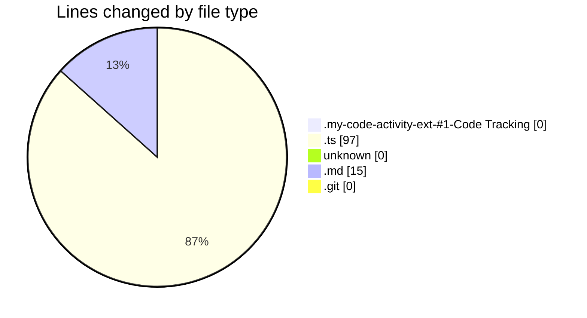
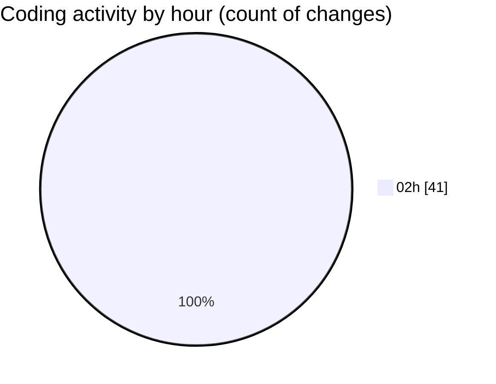

# my-code-activity-ext - Activity Summary ����

## Overall Statistics

| Stat                   | Value                                                             |
| ---------------------- | ----------------------------------------------------------------- |
| **Lines Added** (➕)   | 112                                          |
| **Lines Removed** (➖) | 0                                        |
| **Net Change** (↕)    | 112                |
| **Active Time** (⌚)   | 37 minutes |

## Modified Files
- **extension-output-undefined_publisher.my-code-activity-ext-#1-Code Tracking** (+0, -0)
- **auth.ts** (+97, -0)
- **** (+0, -0)
- **easter egg.md** (+15, -0)
- **input** (+0, -0)
- **easter egg.md.git** (+0, -0)

## Visualizations

### By File Type (Lines Changed)

### By Hour (Estimated Activity Count)

> **Last Updated:** 25/12/2024 02:41:16