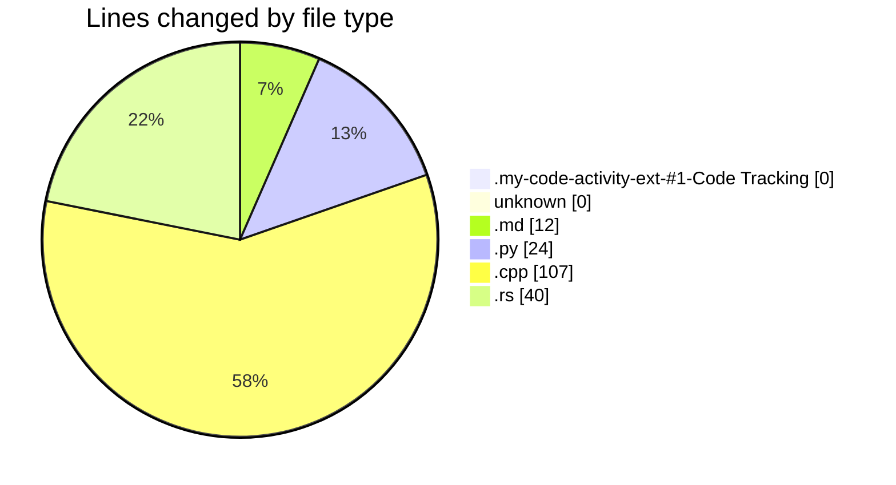

# leetcode-solutions - Activity Summary ����

## Overall Statistics

| Stat                   | Value                                                             |
| ---------------------- | ----------------------------------------------------------------- |
| **Lines Added** (➕)   | 149                                          |
| **Lines Removed** (➖) | 34                                        |
| **Net Change** (↕)    | 115                |
| **Active Time** (⌚)   | 155 minutes |

## Modified Files
- **extension-output-undefined_publisher.my-code-activity-ext-#1-Code Tracking** (+0, -0)
- **** (+0, -0)
- **JOURNAL.md** (+12, -0)
- **494.py** (+23, -1)
- **15.cpp** (+75, -32)
- **88.rs** (+25, -1)
- **input** (+0, -0)
- **74.rs** (+14, -0)

## Visualizations

### By File Type (Lines Changed)

### By Hour (Estimated Activity Count)

> **Last Updated:** 26/12/2024 12:55:05