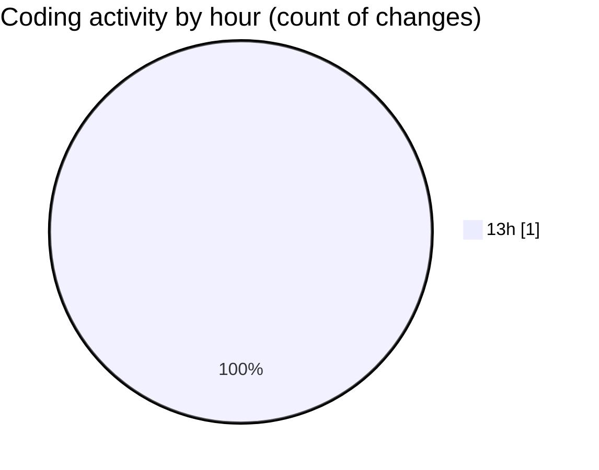

# repositories - Activity Summary ����

## Overall Statistics

| Stat                   | Value                                                             |
| ---------------------- | ----------------------------------------------------------------- |
| **Lines Added** (➕)   | 0                                          |
| **Lines Removed** (➖) | 0                                        |
| **Net Change** (↕)    | 0                |
| **Active Time** (⌚)   | 0 minute |


## Modified Files
- **extension-output-undefined_publisher.my-code-activity-ext-#1-Code Tracking** (+0, -0)

## Visualizations

### By File Type (Lines Changed)

```mermaid
pie showData
title Lines changed by file type
".my-code-activity-ext-#1-Code Tracking" : 0
```

### By Hour (Estimated Activity Count)




> **Last Updated:** 26/12/2024 13:09:47