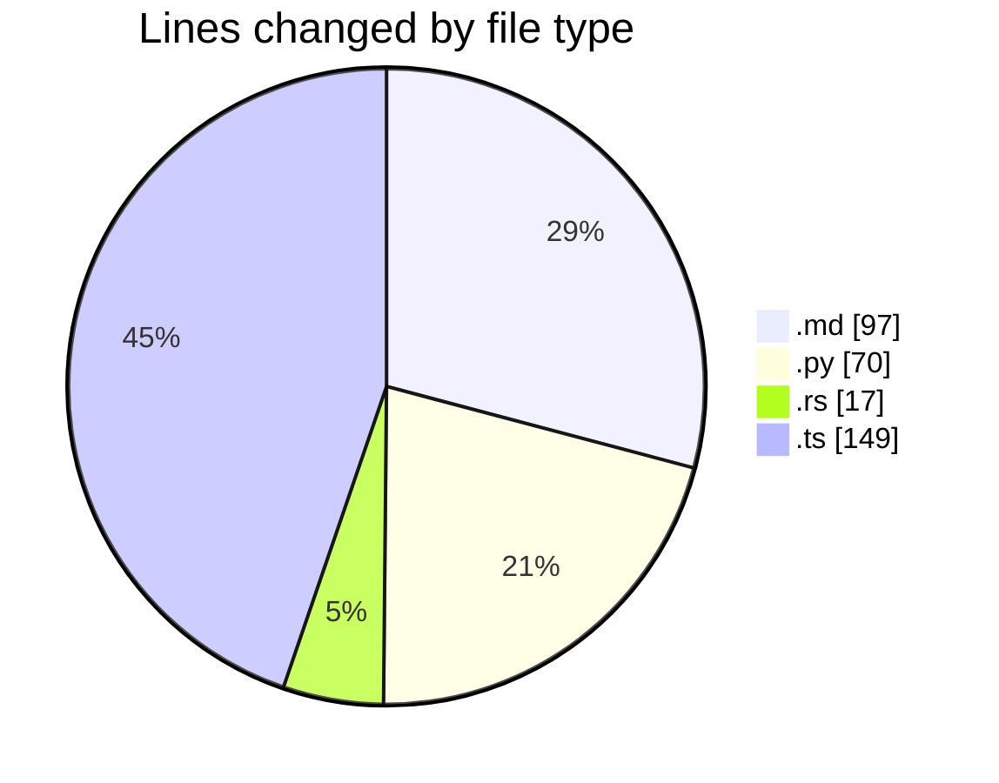

# leetcode-solutions - Activity Summary 

## Overall Statistics

| Stat                   | Value                                                             |
| ---------------------- | ----------------------------------------------------------------- |
| **Lines Added** (➕)   | 302                                          |
| **Lines Removed** (➖) | 31                                        |
| **Net Change** (↕)    | 271                |
| **Active Time** (⌚)   | 39 minutes |

## Modified Files
- **README.md** (+72, -0)
- **689.py** (+53, -17)
- **JOURNAL.md** (+25, -0)
- **1014.rs** (+17, -0)
- **24.ts** (+40, -9)
- **42.ts** (+26, -2)
- **44.ts** (+28, -3)
- **51.ts** (+41, -0)

## Visualizations

### By File Type (Lines Changed)

### By Hour (Estimated Activity Count)

> **Last Updated:** 28/12/2024 03:47:33